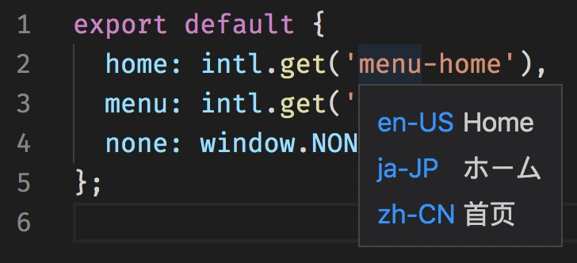

Show i18n message on hover.

## Configuration

| Key                 | Type       | Description                    | Default            |
| ------------------- | ---------- | ------------------------------ | ------------------ |
| i18n_hover.patterns | `string[]` | Patterns for Locale File Paths | ["**/locale/*.js"] |

## Screenshot

